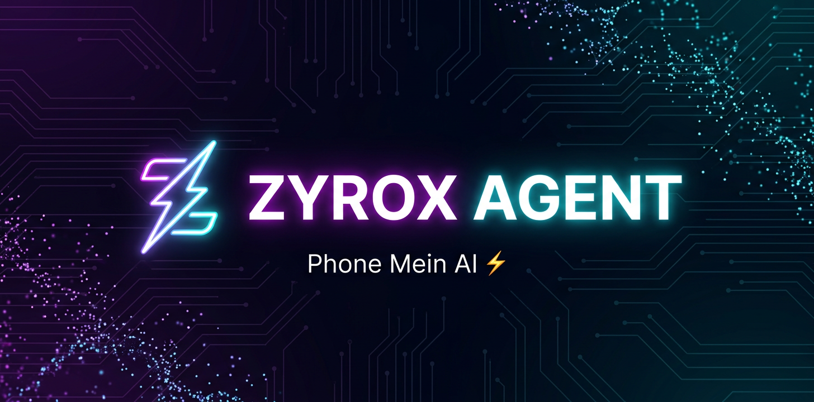

<div align="center">



[](https://termux.dev)
[](LICENSE)
[](CHANGELOG.md)
[](package.json)

**⚡ AI toolkit for Termux — ek command, sab kuch.**

Local LLMs phone par (100% offline) · Gemini cloud chat · Coding agents

`Android` · `ARM64` · `No root` · `MIT License`

</div>

---

</br>

## ✨ ZYROX kya hai?

| Feature | Detail |
|---|---|
| 🤖 **Local AI models** | Qwen, Gemma, DeepSeek… phone par hi chalte hain — **bina internet, bina API key** |
| ☁️ **Gemini cloud chat** | Apni Gemini API key se — `zyrox gemini "question"` |
| 🧑‍💻 **Coding agents** | Qwen Code (2000 free req/day), Codex, Pi — `zyrox launch` |
| 🔒 **Secure install** | Har download SHA256-verified + archive safety checks |
| 🪶 **Lightweight** | Ek hi command, zero npm dependencies |

## 📲 Installation (Termux)

```bash
pkg update && pkg upgrade -y
pkg install nodejs-lts git -y
npm install -g github:zyroxteam/ZyroxAgentS
zyrox install
```

Bas! Ab `zyrox` type karo.

## 🚀 Usage

### 1️⃣ Local AI (offline, free)

```bash
zyrox serve &              # server start (background)
zyrox pull qwen3.5:4b      # model download (8GB RAM phones)
zyrox run qwen3.5:4b       # chat — airplane mode mein bhi chalega!
zyrox list                 # installed models
zyrox stop                 # running models stop
```

**Apne RAM ke hisaab se model:**

| Phone RAM | Model |
|---|---|
| 4–6 GB | `qwen3.5:0.5b` ya `gemma4:1b` |
| 8 GB | `qwen3.5:4b` ya `gemma4:e4b` ⭐ recommended |
| 12–16 GB | 9B models tak |

### 2️⃣ Gemini cloud chat (aapki API key)

```bash
export GEMINI_API_KEY="your-key"     # free key: https://aistudio.google.com/apikey
zyrox gemini "explain quantum computing in simple words"
zyrox gemini                          # interactive chat mode
export GEMINI_MODEL="gemini-2.5-pro"  # (optional) model change
```

> Tip: `echo 'export GEMINI_API_KEY="your-key"' >> ~/.bashrc` se key permanent ho jayegi.

### 3️⃣ Coding agents

```bash
zyrox launch qwen      # Qwen Code — FREE 2000 requests/day (browser sign-in)
zyrox launch codex     # OpenAI Codex (API key / ChatGPT account)
zyrox launch pi        # Pi agent
```

### 4️⃣ Menu

```bash
zyrox                  # interactive menu — sab options ek jagah
zyrox status           # installation status
zyrox help             # all commands
zyrox update           # runtime update
zyrox uninstall        # remove runtime
```

## 📖 Docs

- [Benchmarks](docs/BENCHMARKS.md) — real phones par performance numbers
- [Vulkan GPU](docs/VULKAN_ANDROID_LOADER.md) — GPU acceleration enable karna

## ⚙️ Environment variables

| Variable | Default | Purpose |
|---|---|---|
| `GEMINI_API_KEY` | — | Gemini cloud chat ke liye (free: [aistudio.google.com/apikey](https://aistudio.google.com/apikey)) |
| `GEMINI_MODEL` | auto | Gemini model override |
| `ZYROX_RUNTIME_VERSION` | `0.32.2-termux.1` | Runtime version pin karne ke liye |

## 🧩 Tech / Credits

ZYROX ek rebranded distribution hai — runtime binaries
[ollama-termux](https://github.com/DioNanos/ollama-termux) (MIT) se aate hain,
jo khud [Ollama](https://github.com/ollama/ollama) (MIT) ka Android ARM64 fork hai.
Is repo mein sirf installer/launcher code hai (Termux ke liye jo actually chahiye).

- Upstream installer: [DioNanos/ollama-termux](https://github.com/DioNanos/ollama-termux)
- Runtime: [ollama/ollama](https://github.com/ollama/ollama) + [llama.cpp](https://github.com/ggml-org/llama.cpp)
- Gemini: Google Generative Language API

## 📄 License

MIT — [LICENSE](LICENSE) · [NOTICE](NOTICE)

---

<div align="center">

**ZYROX** ⚡ — *Phone mein AI.*

</div>
